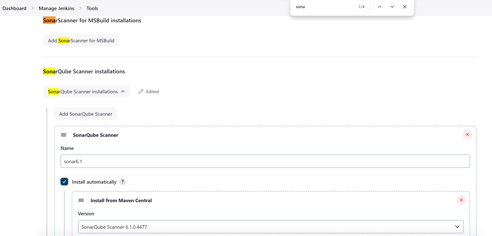
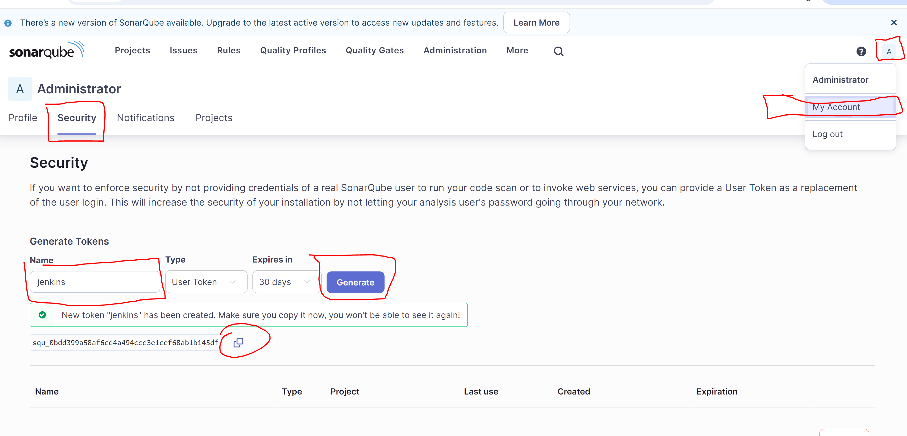

# SonarQube Integration Steps

### Step 1: Verify SonarQube is Running
- Ensure SonarQube is up and running before proceeding. You can follow the instructions for setting up SonarQube from the following [repository](https://github.com/techlearn-center/DevOps/tree/Terraform/exercise7-instance-ubuntu).

### Step 2: Install SonarQube Plugin in Jenkins
1. Go to **Manage Jenkins** > **Manage Plugins**.
2. Click on the **Available** tab.
3. Search for **SonarQube Scanner** plugin.
4. Select the checkbox next to it and click **Install without restart**.
5. Once installed, restart Jenkins if necessary.

### Step 3: Configure SonarQube Scanner in Jenkins
1. Go to **Manage Jenkins** > **Global Tool Configuration (Tools)**.

   (images/manage-jenkins.PNG)

2. Search for **SonarQube Scanner** (use `Ctrl + F` to find it quickly).

   

3. Click on **Add SonarQube Scanner** (not MSBuild).
4. Name the scanner (e.g., `sonar6.1`).
   - The name doesn’t matter, but it should match the name used in your Jenkinsfile for consistency.
5. In the version drop-down, select **SonarQube Scanner 6.1** (or the latest version).

### Step 4: Integrate SonarQube Server in Jenkins
1. In Jenkins, go to **Manage Jenkins** > **Configure System**.
2. Scroll down to the **SonarQube servers** section.
   - If you don’t see this section, make sure you've installed the **SonarQube plugin** as mentioned above.
3. Click on **Add SonarQube**.
4. Check the box for **Environment Variables**.
5. Give the server a display name (e.g., `sonar`)—this should match the name in your Jenkinsfile.
6. In the **SonarQube server URL** field, enter the URL of your SonarQube server.
   - Use the private IP if you're on the same network as the SonarQube server, or the public IP if not.

   

### Step 5: Generate and Add SonarQube Token
1. Go to the SonarQube server and log in.
2. Click on the top-right corner where you see **Administrator** and go to **My Account**.
3. In **My Account**, click on **Security**.
4. Create a token:
   - Give the token a name (e.g., `jenkins`).
   - Click **Generate** and take note of the token (e.g., `36aa86e99531b942c7e540f2bac90dd19386c006`).
   - **Important:** Copy the token immediately as it won’t be visible again after refreshing the page.
5. Go back to Jenkins and click on **Add** under **SonarQube Servers**.
   - It may initially fail to save, but proceed by saving and returning to the configuration page.
6. After saving, click **Add** again, and a popup from Jenkins will appear.
   - Select **Kind: Secret Text** and paste the copied token.
   - Provide an ID and description (e.g., `MySonarToken`).
7. Save the configuration.

   
